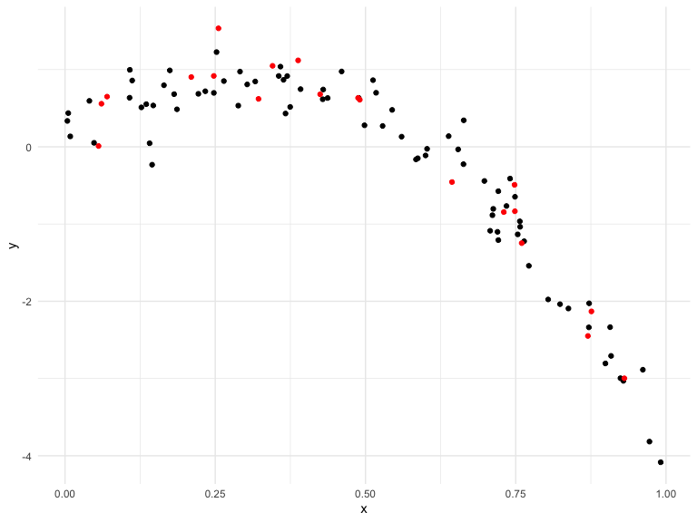
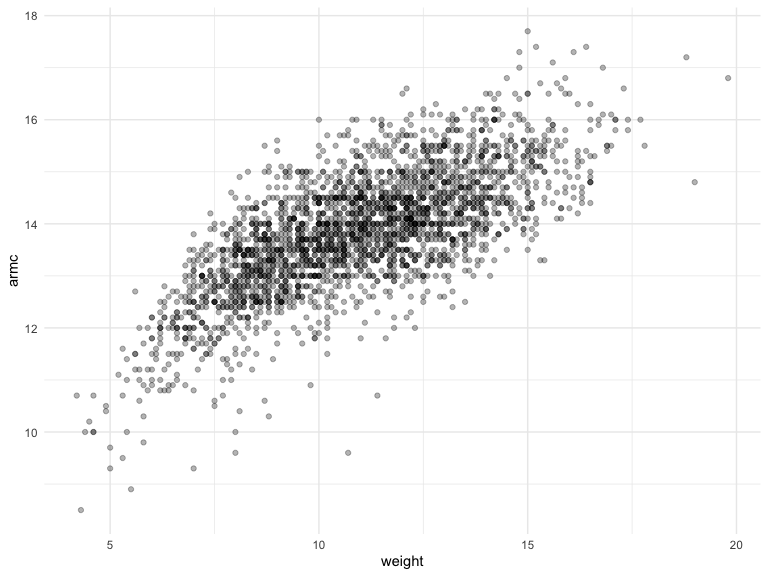

cross_validation
================
Brittany Shea
2022-11-22

## Step one

Cross validation by hand simulation

``` r
nonlin_df = 
  tibble(
    id = 1:100,
    x = runif(100, 0, 1),
    y = 1 - 10 * (x - .3) ^ 2 + rnorm(100, 0, .3)
  )

nonlin_df %>% 
  ggplot(aes(x = x, y = y)) + 
  geom_point()
```


Let’s get this by hand - training & testing datasets

``` r
train_df = sample_n(nonlin_df, 80)
test_df = anti_join(nonlin_df, train_df, by = "id")
```

``` r
train_df %>% 
  ggplot(aes(x = x, y = y)) +
  geom_point() +
  geom_point(data = test_df, color = "red")
```



Let’s try to fit three models.

``` r
linear_mod = lm(y ~ x, data = train_df) #simple linear regression of y versus x

smooth_mod = mgcv::gam(y ~ s(x), data = train_df) #smooth fit between y and x, treating x as something with nonlinearity

wiggly_mod = mgcv::gam(y ~ s(x, k = 30), sp = 10e-6, data = train_df) # make sure gam is giving us something too wiggly
```

Let’s see the results – add column with predictions

``` r
train_df %>% 
  add_predictions(wiggly_mod) %>% 
  ggplot(aes(x = x, y = y)) +
  geom_point() +
  geom_point(data = test_df, color = "red") +
  geom_line(aes(y = pred), color = "red")
```


``` r
# which of these will do a better job at getting the red lines right??
```

Let’s make predictions and compute RMSEs: to see which model is making
best prediction on dataset, do cross validation

``` r
test_df %>% add_predictions(linear_mod)
```

    ## # A tibble: 20 × 4
    ##       id      x       y     pred
    ##    <int>  <dbl>   <dbl>    <dbl>
    ##  1     2 0.730  -0.845  -1.12   
    ##  2    12 0.749  -0.834  -1.19   
    ##  3    14 0.210   0.903   0.793  
    ##  4    17 0.255   1.53    0.626  
    ##  5    18 0.760  -1.25   -1.23   
    ##  6    24 0.388   1.12    0.139  
    ##  7    29 0.0700  0.650   1.31   
    ##  8    35 0.425   0.680   0.00424
    ##  9    40 0.644  -0.456  -0.802  
    ## 10    43 0.870  -2.45   -1.63   
    ## 11    47 0.248   0.918   0.655  
    ## 12    49 0.748  -0.492  -1.19   
    ## 13    51 0.322   0.620   0.381  
    ## 14    62 0.931  -3.00   -1.86   
    ## 15    64 0.0606  0.558   1.34   
    ## 16    72 0.876  -2.13   -1.66   
    ## 17    77 0.491   0.609  -0.238  
    ## 18    89 0.488   0.633  -0.228  
    ## 19    90 0.345   1.05    0.295  
    ## 20    93 0.0558  0.0103  1.36

``` r
# training/testing split
# lower is better -- lower prediction error means predictions were more accurate
rmse(linear_mod, test_df)
```

    ## [1] 0.7164988

``` r
rmse(smooth_mod, test_df)
```

    ## [1] 0.2835636

``` r
rmse(wiggly_mod, test_df)
```

    ## [1] 0.2724344

## Can we iterate…?

``` r
cv_df = 
  crossv_mc(nonlin_df, 100) %>% # convert splits 
  mutate( #convert all to tibbles
    train = map(train, as_tibble),
    test = map(test, as_tibble),
  ) %>% 
  mutate(
    linear_fits = map(.x = train, ~lm(y ~ x, data = .x)),
    smooth_fits = map(.x = train, ~mgcv::gam(y ~ s(x), data = .x)),
    wiggly_fits = map(.x = train, ~mgcv::gam(y ~ s(x, k = 30), sp = 10e-6, data = .x))
    ) %>%  
  mutate(
    rmse_linear = map2_dbl(.x = linear_fits, .y = test, ~rmse(model = .x, data = .y)),
    rmse_smooth = map2_dbl(.x = smooth_fits, .y = test, ~rmse(model = .x, data = .y)),
    rmse_wiggly = map2_dbl(.x = wiggly_fits, .y = test, ~rmse(model = .x, data = .y)),
    )

#use "dbl" after map2 to make into numbers in rmse column
```

Make a box plot …

``` r
cv_df %>% 
  select(starts_with("rmse")) %>% 
  pivot_longer(
    everything(),
    names_to = "model",
    values_to = "rmse",
    names_prefix = "rmse_"
  ) %>% 
  ggplot(aes(x = model, y = rmse)) +
  geom_boxplot()
```


Try it on a real dataset

``` r
growth_df = read_csv("data/nepalese_children.csv")
```

    ## Rows: 2705 Columns: 5
    ## ── Column specification ────────────────────────────────────────────────────────
    ## Delimiter: ","
    ## dbl (5): age, sex, weight, height, armc
    ## 
    ## ℹ Use `spec()` to retrieve the full column specification for this data.
    ## ℹ Specify the column types or set `show_col_types = FALSE` to quiet this message.

``` r
growth_df %>% 
  ggplot(aes(x = weight, y= armc)) +
  geom_point(alpha = .3)
```



Brief aside piecewise linear models.

``` r
growth_df = 
  growth_df %>% 
  mutate(
    weight_pwl = (weight > 7) * (weight - 7)
  )
```

``` r
pwl_model = lm(armc ~ weight + weight_pwl, data = growth_df)
```

# fit a linear model

``` r
linear_model = lm(armc ~ weight, data = growth_df)
pwl_model = lm(armc ~ weight + weight_pwl, data = growth_df)
smooth_model = mgcv::gam(armc ~s(weight), data = growth_df)
```

# change point fit; can capture non-linearity; linear on one side, and linear on another, but a change in slope

``` r
growth_df %>% 
  add_predictions(smooth_model) %>% 
  ggplot(aes(x = weight, y = armc)) +
  geom_point() +
  geom_line(aes(y = pred), color = "red")
```


``` r
cv_df =
  crossv_mc(growth_df, 100) %>% 
  mutate( 
    train = map(train, as_tibble),
    test = map(test, as_tibble),
  ) 

cv_df = 
  cv_df %>%
  mutate(
    linear_fits = map(.x = train, ~lm(armc ~ weight, data = .x)),
    pwl_fits = map(.x = train, ~lm(armc ~ weight + weight_pwl, data = .x)),
    smooth_fits = map(.x = train, ~mgcv::gam(armc ~ s(weight), data = .x))
    ) %>%  
  mutate(
    rmse_linear = map2_dbl(.x = linear_fits, .y = test, ~rmse(model = .x, data = .y)),
    rmse_pwl = map2_dbl(.x = pwl_fits,       .y = test, ~rmse(model = .x, data = .y)),
    rmse_smooth = map2_dbl(.x = smooth_fits, .y = test, ~rmse(model = .x, data = .y)),
    )
```

Let’s look at the results

``` r
cv_df %>% 
  select(starts_with("rmse")) %>% 
  pivot_longer(
    everything(),
    names_to = "model",
    values_to = "rmse",
    names_prefix = "rmse_"
  ) %>% 
  ggplot(aes(x = model, y = rmse)) +
  geom_boxplot()
```


under fitted models have high bias and low variance over fitted models
have high variance and low bias
