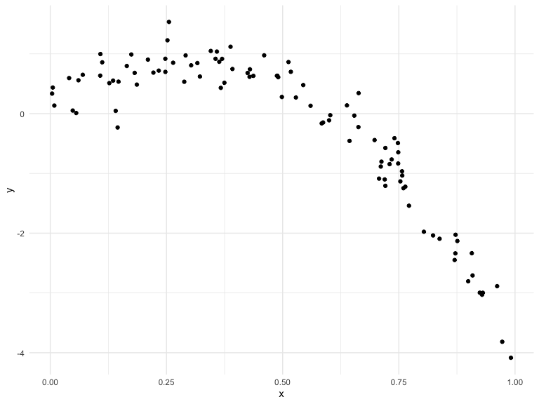

cross_validation
================
Brittany Shea
2022-11-22

## Step one

Cross validation by hand simulation

``` r
nonlin_df = 
  tibble(
    id = 1:100,
    x = runif(100, 0, 1),
    y = 1 - 10 * (x - .3) ^ 2 + rnorm(100, 0, .3)
  )

nonlin_df %>% 
  ggplot(aes(x = x, y = y)) + 
  geom_point()
```



Let’s get this by hand - training & testing datasets

``` r
train_df = sample_n(nonlin_df, 80)
test_df = anti_join(nonlin_df, train_df, by = "id")
```

``` r
train_df %>% 
  ggplot(aes(x = x, y = y)) +
  geom_point() +
  geom_point(data = test_df, color = "red")
```


Let’s try to fit three models.

``` r
linear_mod = lm(y ~ x, data = train_df) #simple linear regression of y versus x

smooth_mod = mgcv::gam(y ~ s(x), data = train_df) #smooth fit between y and x, treating x as something with nonlinearity

wiggly_mod = mgcv::gam(y ~ s(x, k = 30), sp = 10e-6, data = train_df) # make sure gam is giving us something too wiggly
```

Let’s see the results – add column with predictions

``` r
train_df %>% 
  add_predictions(wiggly_mod) %>% 
  ggplot(aes(x = x, y = y)) +
  geom_point() +
  geom_line(aes(y = pred), color = "red")
```


Let’s make predictions and compute RMSEs: to see which model is making
best prediction on dataset, do cross validation

``` r
test_df %>% add_predictions(linear_mod)
```

    ## # A tibble: 20 × 4
    ##       id     x      y   pred
    ##    <int> <dbl>  <dbl>  <dbl>
    ##  1     5 0.157  1.29   1.36 
    ##  2    11 0.193  0.409  1.21 
    ##  3    13 0.384  0.727  0.432
    ##  4    14 0.262  0.864  0.932
    ##  5    19 0.317  0.581  0.705
    ##  6    22 0.782 -1.32  -1.20 
    ##  7    28 0.778 -1.26  -1.18 
    ##  8    33 0.535  0.193 -0.187
    ##  9    35 0.180  1.18   1.26 
    ## 10    42 0.977 -3.28  -1.99 
    ## 11    51 0.777 -1.45  -1.17 
    ## 12    52 0.405  1.58   0.348
    ## 13    60 0.706 -1.32  -0.884
    ## 14    61 0.608 -0.204 -0.481
    ## 15    68 0.452  1.04   0.152
    ## 16    74 0.186  0.497  1.24 
    ## 17    76 0.201  0.343  1.18 
    ## 18    79 0.724 -0.354 -0.956
    ## 19    87 0.867 -1.64  -1.54 
    ## 20   100 0.188  0.515  1.23

``` r
# training/testing split
# lower is better -- lower prediction error means predictions were more accurate
rmse(linear_mod, test_df)
```

    ## [1] 0.6071575

``` r
rmse(smooth_mod, test_df)
```

    ## [1] 0.4122208

``` r
rmse(wiggly_mod, test_df)
```

    ## [1] 0.4667691

## Can we iterate…?

``` r
cv_df = 
  crossv_mc(nonlin_df, 100) %>% # convert splits 
  mutate( #convert all to tibbles
    train = map(train, as_tibble),
    test = map(test, as_tibble),
  ) %>% 
  mutate(
    linear_fits = map(.x = train, ~lm(y ~ x, data = .x)) #fit linear model for all the dataframes in train column each time
  )

# cv_df %>% pull(train) %>% .[[2]] %>% as_tibble
```
